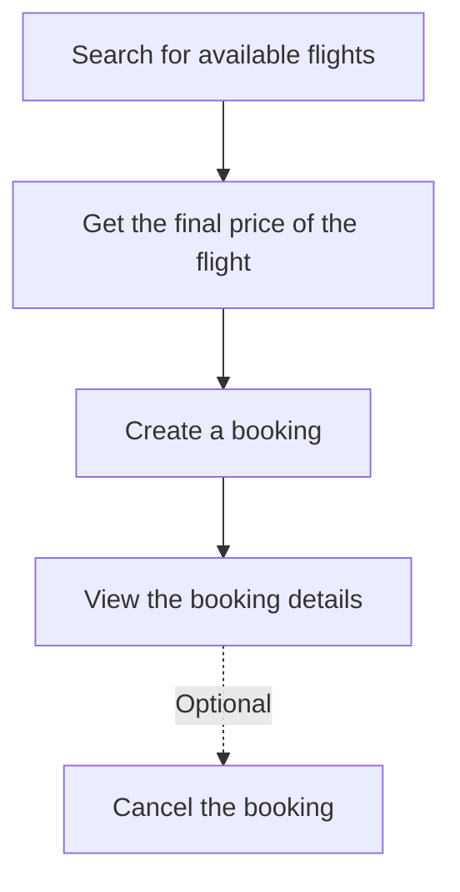

# Flight Booking API Documentation

## Server Information
- Base URL: `https://flight-agent.onrender.com`
- Interactive API Documentation (Swagger UI): `https://flight-agent.onrender.com/docs`
- OpenAPI Specification: `https://flight-agent.onrender.com/openapi.json`

## Overview
This API provides endpoints for managing flight bookings, including searching for airports and flights, getting flight prices, creating bookings, and managing existing bookings.

The intended flow to book a flight is as follows:
1. Search for available flights based on the search criteria (origin, destination, departure date, adults) using the `/flights/search` endpoint
2. Get the final price of the flight using the `/flights/offer-price` endpoint
3. Create a booking using the `/flights/bookings` endpoint
4. View the booking details using the `/flights/bookings/{booking_id}` endpoint
5. Optionally, cancel the booking using the `/flights/bookings/{booking_id}` endpoint

A Mermaid flowchart for the above flow is as follows:



## Common Response Codes
- `200 OK`: Request successful
- `201 Created`: Resource successfully created
- `400 Bad Request`: Invalid request parameters
- `404 Not Found`: Requested resource not found
- `500 Internal Server Error`: Server-side error

## Endpoints

### 1. Search for Airports and Cities
Search for airports and cities based on a keyword.

**Endpoint:** `GET /flights/locations/search`

**Query Parameters:**
- `keyword` (string, required): Search term to find matching airports/cities
- `type` (string, optional): Filter results by location type. Can be "AIRPORT", "CITY", or leave empty to search both

**Response:** Array of location objects

**Example Usage:**
```http
# Search for all locations matching "London"
GET /flights/locations/search?keyword=London

# Search only for airports matching "London"
GET /flights/locations/search?keyword=London&type=AIRPORT
```

**Example Response:**
```json
[
  {
    "type": "location",
    "subType": "AIRPORT",
    "name": "HEATHROW",
    "detailedName": "LONDON/GB:HEATHROW",
    "id": "ALHR",
    "self": {
      "href": "https://test.api.amadeus.com/v1/reference-data/locations/ALHR",
      "methods": [
        "GET"
      ]
    },
    "timeZoneOffset": "+00:00",
    "iataCode": "LHR",
    "geoCode": {
      "latitude": 51.4775,
      "longitude": -0.46138
    },
    "address": {
      "cityName": "LONDON",
      "cityCode": "LON",
      "countryName": "UNITED KINGDOM",
      "countryCode": "GB",
      "regionCode": "EUROP"
    },
    "analytics": {
      "travelers": {
        "score": 45
      }
    }
  },
  {
    "type": "location",
    "subType": "AIRPORT",
    "name": "GATWICK",
    "detailedName": "LONDON/GB:GATWICK",
    "id": "ALGW",
    "self": {
      "href": "https://test.api.amadeus.com/v1/reference-data/locations/ALGW",
      "methods": [
        "GET"
      ]
    },
    "timeZoneOffset": "+00:00",
    "iataCode": "LGW",
    "geoCode": {
      "latitude": 51.15612,
      "longitude": -0.17805
    },
    "address": {
      "cityName": "LONDON",
      "cityCode": "LON",
      "countryName": "UNITED KINGDOM",
      "countryCode": "GB",
      "regionCode": "EUROP"
    },
    "analytics": {
      "travelers": {
        "score": 27
      }
    }
  },
  ...
]
```

### 2. Get Direct Flight Destinations
Get all direct flight destinations from a given origin airport.

**Endpoint:** `GET /flights/destinations`

**Query Parameters:**
- `origin` (string, required): IATA code of the origin airport (e.g., "BOM" for Mumbai)

**Response:** Array of destination objects

**Example Usage:**
```http
GET /flights/destinations?origin=BOM
```

**Example Response:**
```json
[
  {
    "type": "location",
    "subtype": "city",
    "name": "ADDIS ABABA",
    "iataCode": "ADD",
    "geoCode": {
      "latitude": 8.97778,
      "longitude": 38.79945
    },
    "address": {
      "countryName": "ETHIOPIA",
      "countryCode": "ET",
      "regionCode": "AFRIC"
    },
    "timeZone": {
      "offSet": "+03:00",
      "referenceLocalDateTime": "2025-03-26T02:01:14"
    }
  },
  {
    "type": "location",
    "subtype": "city",
    "name": "ADEN",
    "iataCode": "ADE",
    "geoCode": {
      "latitude": 12.82945,
      "longitude": 45.02889
    },
    "address": {
      "countryName": "YEMEN REPUBLIC",
      "countryCode": "YE",
      "regionCode": "MEAST"
    },
    "timeZone": {
      "offSet": "+03:00",
      "referenceLocalDateTime": "2025-03-26T02:01:14"
    }
  },
  ...
]
```

### 3. Search for Available Flights
Search for available flights based on the provided criteria.

**Endpoint:** `GET /flights/search`

**Query Parameters:**
- `origin` (string, required): IATA code of the departure airport
- `destination` (string, required): IATA code of the arrival airport
- `departure_date` (string, required): Date of departure (YYYY-MM-DD)
- `adults` (integer, optional, default=1): Number of adult passengers (1-9)

**Response:** Array of flight offer objects

**Example Usage:**
```http
# Search for flights from Mumbai to Delhi
GET /flights/search?origin=DEL&destination=BOM&departure_date=2025-04-10&adults=1
```

**Example Response:**
```json
[
  {
    "type": "flight-offer",
    "id": "1",
    "source": "GDS",
    "instantTicketingRequired": false,
    "nonHomogeneous": false,
    "oneWay": false,
    "isUpsellOffer": false,
    "lastTicketingDate": "2025-03-26",
    "lastTicketingDateTime": "2025-03-26",
    "numberOfBookableSeats": 9,
    "itineraries": [
      {
        "duration": "PT2H15M",
        "segments": [
          {
            "departure": {
              "iataCode": "DEL",
              "terminal": "3",
              "at": "2025-04-10T14:45:00"
            },
            "arrival": {
              "iataCode": "BOM",
              "terminal": "2",
              "at": "2025-04-10T17:00:00"
            },
            "carrierCode": "AI",
            "number": "856",
            "aircraft": {
              "code": "32A"
            },
            "operating": {
              "carrierCode": "AI"
            },
            "duration": "PT2H15M",
            "id": "8",
            "numberOfStops": 0,
            "blacklistedInEU": false
          }
        ]
      }
    ],
    "price": {
      "currency": "INR",
      "total": "5919.00",
      "base": "5096.00",
      "fees": [
        {
          "amount": "0.00",
          "type": "SUPPLIER"
        },
        {
          "amount": "0.00",
          "type": "TICKETING"
        }
      ],
      "grandTotal": "5919.00"
    },
    "pricingOptions": {
      "fareType": [
        "PUBLISHED"
      ],
      "includedCheckedBagsOnly": true
    },
    "validatingAirlineCodes": [
      "AI"
    ],
    "travelerPricings": [
      {
        "travelerId": "1",
        "fareOption": "STANDARD",
        "travelerType": "ADULT",
        "price": {
          "currency": "INR",
          "total": "5919.00",
          "base": "5096.00"
        },
        "fareDetailsBySegment": [
          {
            "segmentId": "8",
            "cabin": "ECONOMY",
            "fareBasis": "TU1YXSII",
            "brandedFare": "ECOVALU",
            "brandedFareLabel": "ECO VALUE",
            "class": "T",
            "includedCheckedBags": {
              "weight": 15,
              "weightUnit": "KG"
            },
            "includedCabinBags": {
              "weight": 7,
              "weightUnit": "KG"
            },
            "amenities": [
              {
                "description": "PRE RESERVED SEAT ASSIGNMENT",
                "isChargeable": false,
                "amenityType": "PRE_RESERVED_SEAT",
                "amenityProvider": {
                  "name": "BrandedFare"
                }
              },
              {
                "description": "MEAL SERVICES",
                "isChargeable": false,
                "amenityType": "MEAL",
                "amenityProvider": {
                  "name": "BrandedFare"
                }
              },
              {
                "description": "REFUNDABLE TICKET",
                "isChargeable": true,
                "amenityType": "BRANDED_FARES",
                "amenityProvider": {
                  "name": "BrandedFare"
                }
              },
              {
                "description": "CHANGEABLE TICKET",
                "isChargeable": true,
                "amenityType": "BRANDED_FARES",
                "amenityProvider": {
                  "name": "BrandedFare"
                }
              },
              {
                "description": "UPGRADE",
                "isChargeable": true,
                "amenityType": "UPGRADES",
                "amenityProvider": {
                  "name": "BrandedFare"
                }
              },
              {
                "description": "FREE CHECKED BAGGAGE ALLOWANCE",
                "isChargeable": false,
                "amenityType": "BRANDED_FARES",
                "amenityProvider": {
                  "name": "BrandedFare"
                }
              }
            ]
          }
        ]
      }
    ]
  },
  ...
]
```

### 4. Get Flight Offer Price
Get the final price for a flight offer including all taxes and fees.

**Endpoint:** `POST /flights/offer-price`

**Request Body:**
A flight offer object returned from the search endpoint
```json
{
  <one of the flight offer objects returned from the search endpoint>
}
```

**Response:** Flight offer with final pricing details

**Example Usage:**
```http
POST /flights/offer-price
Content-Type: application/json

{
  <one of the flight offer objects returned from the search endpoint>
}
```

**Example Response:**
```json
{
  "type": "flight-offers-pricing",
  "flightOffers": [
    {
      "type": "flight-offer",
      "id": "1",
      "source": "GDS",
      "instantTicketingRequired": false,
      "nonHomogeneous": false,
      "paymentCardRequired": false,
      "lastTicketingDate": "2025-03-26",
      "itineraries": [
        {
          "segments": [
            {
              "departure": {
                "iataCode": "DEL",
                "terminal": "3",
                "at": "2025-04-10T14:45:00"
              },
              "arrival": {
                "iataCode": "BOM",
                "terminal": "2",
                "at": "2025-04-10T17:00:00"
              },
              "carrierCode": "AI",
              "number": "856",
              "aircraft": {
                "code": "32A"
              },
              "operating": {
                "carrierCode": "AI"
              },
              "duration": "PT2H15M",
              "id": "8",
              "numberOfStops": 0,
              "co2Emissions": [
                {
                  "weight": 79,
                  "weightUnit": "KG",
                  "cabin": "ECONOMY"
                }
              ]
            }
          ]
        }
      ],
      "price": {
        "currency": "INR",
        "total": "5919.00",
        "base": "5096.00",
        "fees": [
          {
            "amount": "0.00",
            "type": "SUPPLIER"
          },
          {
            "amount": "0.00",
            "type": "TICKETING"
          },
          {
            "amount": "0.00",
            "type": "FORM_OF_PAYMENT"
          }
        ],
        "grandTotal": "5919.00",
        "billingCurrency": "INR"
      },
      "pricingOptions": {
        "fareType": [
          "PUBLISHED"
        ],
        "includedCheckedBagsOnly": true
      },
      "validatingAirlineCodes": [
        "AI"
      ],
      "travelerPricings": [
        {
          "travelerId": "1",
          "fareOption": "STANDARD",
          "travelerType": "ADULT",
          "price": {
            "currency": "INR",
            "total": "5919",
            "base": "5096",
            "taxes": [
              {
                "amount": "236.00",
                "code": "P2"
              },
              {
                "amount": "62.00",
                "code": "IN"
              },
              {
                "amount": "264.00",
                "code": "K3"
              },
              {
                "amount": "91.00",
                "code": "WO"
              },
              {
                "amount": "170.00",
                "code": "YR"
              }
            ],
            "refundableTaxes": "1169"
          },
          "fareDetailsBySegment": [
            {
              "segmentId": "8",
              "cabin": "ECONOMY",
              "fareBasis": "TU1YXSII",
              "brandedFare": "ECOVALU",
              "class": "T",
              "includedCheckedBags": {
                "weight": 15,
                "weightUnit": "KG"
              }
            }
          ]
        }
      ]
    }
  ],
  "bookingRequirements": {
    "emailAddressRequired": true,
    "mobilePhoneNumberRequired": true
  }
}
```

### 5. Create a Flight Booking
Create a flight booking using the provided flight offer and traveler details.

**Endpoint:** `POST /flights/bookings`

**Request Body:**
```json
{
  <one of the flight offer objects returned from the search endpoint>
}
```

**Response:** Booking confirmation details

**Example Usage:**
```http
POST /flights/bookings
Content-Type: application/json

{
  "flight_offer": {
    <one of the flight offer objects returned from the search endpoint>
  },
  "travelers": {
    <traveler details>
  }
}
```

An example of traveler details is:
```json
[{
  "id": "1",
  "dateOfBirth": "1982-01-16",
  "name": {
    "firstName": "JORGE",
    "lastName": "GONZALES"
  },
  "gender": "MALE",
  "contact": {
    "emailAddress": "jorge.gonzales833@telefonica.es",
    "phones": [
      {
        "deviceType": "MOBILE",
        "countryCallingCode": "34",
        "number": "480080076"
      }
    ]
  },
  "documents": [
    {
      "documentType": "PASSPORT",
      "birthPlace": "Madrid",
      "issuanceLocation": "Madrid",
      "issuanceDate": "2015-04-14",
      "number": "00000000",
      "expiryDate": "2025-04-14",
      "issuanceCountry": "ES",
      "validityCountry": "ES",
      "nationality": "ES",
      "holder": true
    }
  ]
}]
```

**Example Response:**
```json
{
  "type": "flight-order",
  "id": "eJzTd9f3drQM9A8GAAsAAl4%3D",
  "queuingOfficeId": "NCE4D31SB",
  "associatedRecords": [
    {
      "reference": "KA9QOS",
      "creationDate": "2025-03-26T02:18:00.000",
      "originSystemCode": "GDS",
      "flightOfferId": "1"
    }
  ],
  "flightOffers": [
    {
      "type": "flight-offer",
      "id": "1",
      "source": "GDS",
      "nonHomogeneous": false,
      "lastTicketingDate": "2025-03-26",
      "itineraries": [
        {
          "segments": [
            {
              "departure": {
                "iataCode": "DEL",
                "terminal": "3",
                "at": "2025-04-10T14:45:00"
              },
              "arrival": {
                "iataCode": "BOM",
                "terminal": "2",
                "at": "2025-04-10T17:00:00"
              },
              "carrierCode": "AI",
              "number": "856",
              "aircraft": {
                "code": "32A"
              },
              "duration": "PT2H15M",
              "id": "8",
              "numberOfStops": 0,
              "co2Emissions": [
                {
                  "weight": 79,
                  "weightUnit": "KG",
                  "cabin": "ECONOMY"
                }
              ]
            }
          ]
        }
      ],
      "price": {
        "currency": "INR",
        "total": "5919.00",
        "base": "5096.00",
        "fees": [
          {
            "amount": "0.00",
            "type": "TICKETING"
          },
          {
            "amount": "0.00",
            "type": "SUPPLIER"
          },
          {
            "amount": "0.00",
            "type": "FORM_OF_PAYMENT"
          }
        ],
        "grandTotal": "5919.00",
        "billingCurrency": "INR"
      },
      "pricingOptions": {
        "fareType": [
          "PUBLISHED"
        ],
        "includedCheckedBagsOnly": true
      },
      "validatingAirlineCodes": [
        "AI"
      ],
      "travelerPricings": [
        {
          "travelerId": "1",
          "fareOption": "STANDARD",
          "travelerType": "ADULT",
          "price": {
            "currency": "INR",
            "total": "5919.00",
            "base": "5096.00",
            "taxes": [
              {
                "amount": "62.00",
                "code": "IN"
              },
              {
                "amount": "264.00",
                "code": "K3"
              },
              {
                "amount": "236.00",
                "code": "P2"
              },
              {
                "amount": "91.00",
                "code": "WO"
              },
              {
                "amount": "170.00",
                "code": "YR"
              }
            ],
            "refundableTaxes": "1169.00"
          },
          "fareDetailsBySegment": [
            {
              "segmentId": "8",
              "cabin": "ECONOMY",
              "fareBasis": "TU1YXSII",
              "brandedFare": "ECOVALU",
              "class": "T",
              "includedCheckedBags": {
                "weight": 15,
                "weightUnit": "KG"
              }
            }
          ]
        }
      ]
    }
  ],
  "travelers": [
    {
      "id": "1",
      "dateOfBirth": "1982-01-16",
      "gender": "MALE",
      "name": {
        "firstName": "JORGE",
        "lastName": "GONZALES"
      },
      "documents": [
        {
          "number": "00000000",
          "issuanceDate": "2015-04-14",
          "expiryDate": "2025-04-14",
          "issuanceCountry": "ES",
          "issuanceLocation": "Madrid",
          "nationality": "ES",
          "birthPlace": "Madrid",
          "documentType": "PASSPORT",
          "holder": true
        }
      ],
      "contact": {
        "purpose": "STANDARD",
        "phones": [
          {
            "deviceType": "MOBILE",
            "countryCallingCode": "34",
            "number": "480080076"
          }
        ],
        "emailAddress": "jorge.gonzales833@telefonica.es"
      }
    }
  ],
  "ticketingAgreement": {
    "option": "CONFIRM"
  },
  "automatedProcess": [
    {
      "code": "IMMEDIATE",
      "queue": {
        "number": "0",
        "category": "0"
      },
      "officeId": "NCE4D31SB"
    }
  ]
}
```

### 6. Get Booking Details
Retrieve details of an existing booking.

**Endpoint:** `GET /flights/bookings/{booking_id}`

**Path Parameters:**
- `booking_id` (string, required): Unique identifier of the booking

**Response:** Detailed booking information

**Example Usage:**
```http
GET /flights/bookings/eJzTd9f3drQM9A8GAAsAAl4%3D
```

**Example Response:**
```json
{
  "type": "flight-order",
  "id": "eJzTd9f3drQM9A8GAAsAAl4%3D",
  "queuingOfficeId": "NCE4D31SB",
  "associatedRecords": [
    {
      "reference": "KA9QOS",
      "originSystemCode": "AI",
      "flightOfferId": "1"
    },
    {
      "reference": "KA9QOS",
      "creationDate": "2025-03-26T02:18:00",
      "originSystemCode": "GDS",
      "flightOfferId": "1"
    }
  ],
  "flightOffers": [
    {
      "type": "flight-offer",
      "id": "1",
      "source": "GDS",
      "nonHomogeneous": false,
      "lastTicketingDate": "2025-03-26",
      "itineraries": [
        {
          "segments": [
            {
              "departure": {
                "iataCode": "DEL",
                "terminal": "3",
                "at": "2025-04-10T14:45:00"
              },
              "arrival": {
                "iataCode": "BOM",
                "terminal": "2",
                "at": "2025-04-10T17:00:00"
              },
              "carrierCode": "AI",
              "number": "856",
              "aircraft": {
                "code": "32A"
              },
              "duration": "PT2H15M",
              "bookingStatus": "CONFIRMED",
              "segmentType": "ACTIVE",
              "isFlown": false,
              "id": "1",
              "numberOfStops": 0,
              "co2Emissions": [
                {
                  "weight": 79,
                  "weightUnit": "KG",
                  "cabin": "ECONOMY"
                }
              ]
            }
          ]
        }
      ],
      "price": {
        "currency": "INR",
        "total": "5919.00",
        "base": "5096.00",
        "grandTotal": "5919.00"
      },
      "pricingOptions": {
        "fareType": [
          "PUBLISHED"
        ]
      },
      "validatingAirlineCodes": [
        "AI"
      ],
      "travelerPricings": [
        {
          "travelerId": "1",
          "travelerType": "ADULT",
          "price": {
            "currency": "INR",
            "total": "5919.00",
            "base": "5096.00",
            "taxes": [
              {
                "amount": "62.00",
                "code": "IN"
              },
              {
                "amount": "264.00",
                "code": "K3"
              },
              {
                "amount": "236.00",
                "code": "P2"
              },
              {
                "amount": "91.00",
                "code": "WO"
              },
              {
                "amount": "170.00",
                "code": "YR"
              }
            ]
          },
          "fareDetailsBySegment": [
            {
              "segmentId": "1",
              "cabin": "ECONOMY",
              "fareBasis": "TU1YXSII",
              "class": "T",
              "includedCheckedBags": {
                "weight": 15,
                "weightUnit": "KG"
              }
            }
          ]
        }
      ]
    }
  ],
  "travelers": [
    {
      "id": "1",
      "dateOfBirth": "1982-01-16",
      "gender": "MALE",
      "name": {
        "firstName": "JORGE",
        "lastName": "GONZALES"
      },
      "documents": [
        {
          "number": "00000000",
          "expiryDate": "2025-04-14",
          "issuanceCountry": "ES",
          "nationality": "ES",
          "documentType": "PASSPORT",
          "holder": true
        }
      ],
      "contact": {
        "purpose": "STANDARD",
        "phones": [
          {
            "deviceType": "MOBILE",
            "countryCallingCode": "34",
            "number": "480080076"
          }
        ],
        "emailAddress": "JORGE.GONZALES833@TELEFONICA.ES"
      }
    }
  ],
  "remarks": {
    "general": [
      {
        "subType": "GENERAL_MISCELLANEOUS",
        "text": "PRICING ENTRY FXP/SBF/FF-ECOVALU/R,P,VC-AI,FC-INR/P1",
        "flightOfferIds": [
          "1"
        ]
      }
    ]
  },
  "ticketingAgreement": {
    "option": "CONFIRM"
  },
  "contacts": [
    {
      "purpose": "STANDARD"
    }
  ]
}
```

### 7. Cancel a Booking
Cancel an existing flight booking.

**Endpoint:** `DELETE /flights/bookings/{booking_id}`

**Path Parameters:**
- `booking_id` (string, required): Unique identifier of the booking to cancel

**Response:** boolean

**Example Usage:**
```http
DELETE /flights/bookings/eJzTd9f3drQM9A8GAAsAAl4%3D
```

**Example Response:**
```json
true
```

## Integration Guidelines for LLMs

### Best Practices
1. Always validate input parameters before making requests
2. Handle all possible HTTP status codes appropriately
3. Ensure datetime strings are properly formatted (YYYY-MM-DD for dates)
4. When creating bookings, ensure all required traveler information is provided
5. For searching flights, both origin and destination must be valid IATA codes
6. The number of adults must be between 1 and 9
7. Flight offer objects received from the search endpoint should be used as-is when creating bookings

## Additional Resources
- Interactive API Documentation: Visit the [Swagger UI](https://flight-agent.onrender.com/docs) for interactive API testing
- OpenAPI Specification: Download the [OpenAPI JSON](https://flight-agent.onrender.com/openapi.json) for automated tooling

## Notes
- The API is currently running on an ngrok tunnel, which means the URL may change in the future
- For production use, ensure proper error handling, rate limiting, and authentication mechanisms are implemented
- All endpoints return JSON responses
- Request bodies must be sent with Content-Type: application/json header
